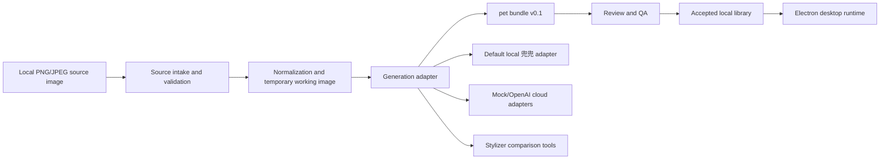

# 兜兜 Digital Human

兜兜是一个本地优先的 image-to-desktop-pet 数字人项目。目标是让用户选择一张本地图片，生成可验证的二次元数字人资产包，并把它作为可互动的桌面陪伴运行起来。


## Status

| Item | Current State |
| --- | --- |
| Phase | Phase 0, vertical-slice development |
| Runtime | Electron desktop overlay, transparent always-on-top window |
| Default character | 兜兜二次元数字人 |
| Bundle contract | `pet bundle v0.1` |
| Default generation | Local non-model adapter with shared 8-frame 兜兜 sprite QA |
| Cloud path | Mock provider by default, OpenAI live provider behind explicit opt-in |
| Production readiness | Developer preview, not a packaged release |

## Table of Contents

- [Why This Exists](#why-this-exists)
- [Features](#features)
- [Quick Start](#quick-start)
- [Core Workflows](#core-workflows)
- [Architecture](#architecture)
- [Repository Layout](#repository-layout)
- [Quality Gates](#quality-gates)
- [Privacy and Safety](#privacy-and-safety)
- [Documentation](#documentation)
- [Development Rules](#development-rules)
- [Roadmap](#roadmap)
- [License](#license)

## Why This Exists

兜兜验证一条完整产品链路：

1. 用户提供本地 PNG/JPEG 图片。
2. 项目验证、规范化并处理图片，不把源图复制进最终资产包。
3. 生成 8 帧 兜兜二次元数字人 sprite atlas。
4. 将资产打包成严格的 `pet bundle v0.1`。
5. 在 Electron 桌面窗口中加载、动画播放并响应交互。

当前阶段优先证明端到端路径、资产契约、隐私边界和可验证质量，而不是先追求复杂模型、账号系统或发布市场。

## Features

- **本地默认生成**: `generate:pet` 使用 `doudou-digital-human-adapter`，从源图提取小面积色彩点缀，并输出项目自有的 兜兜二次元数字人资产。
- **8 帧资产质量门**: 默认 fixture 与生成资产共享 8 帧 sprite QA，覆盖尺寸、帧差异、头发/皮肤/服装/领口可读性、表情帧和无动物耳朵哨点。
- **严格 bundle 契约**: 运行时只消费 `pet.json`、`preview.png`、`atlases/main.png`、`source.meta.json`，并拒绝未引用或越界文件。
- **桌面运行时**: Electron 透明窗口支持 idle、tap reaction、拖动、缩放、alpha hit test、靠近/躲避/观看/工作等运行时状态。
- **引导式管理器**: `npm run dev:app` 提供选图、风格对比、生成、预览检查、接受、启动、停止、删除的完整开发者流程。
- **云端边界**: mock cloud 走完整确认路径但不发起真实网络生成；OpenAI live 需要环境变量和每次上传确认。
- **Live2D 研究轨道**: 默认 兜兜 Live2D 表情、Cubism 边界和官方 SDK smoke 留在 runtime research 路径，不污染 `pet bundle v0.1`。

## Quick Start

### Prerequisites

- Node.js and npm.
- macOS is the primary target for the current desktop runtime slice.
- Dependencies installed from the committed `package-lock.json`.

```bash
npm install
```

### Run the Guided App

```bash
npm run dev:app
```

Shortest local flow:

1. Click `选择图片` and select a local PNG/JPEG.
2. Keep generation mode as `本地`.
3. Optional: click `风格对比`.
4. Click `生成`.
5. Click `预览检查`.
6. Click `接受`.
7. Click `启动`.
8. Click `停止` when done.

More details live in [docs/GUIDED_APP_QUICKSTART.md](docs/GUIDED_APP_QUICKSTART.md).

### Launch the Runtime Fixture

```bash
npm run dev
```

This bypasses the guided manager and launches `fixtures/pet_bundles/valid_minimal_atlas_pet` directly.

### Generate a Local Bundle from an Image

Use an ignored output directory such as `output/` for manual runs:

```bash
npm --silent run generate:pet -- <source-image-path> output/generated-doudou
```

`--silent` is recommended when using personal paths because npm may echo command arguments.

### Review a Generated Bundle

```bash
npm run review:pet -- qa output/generated-doudou output/review-generated-doudou
npm run review:pet -- accept output/generated-doudou output/library
```

Delete review or accepted assets only through an explicit allowed root:

```bash
npm run review:pet -- delete output/review-generated-doudou --root output
```

## Core Workflows

### Local Development

```bash
npm run typecheck
npm test
npm run build
```

### Runtime Smoke

```bash
npm run smoke:runtime
```

This validates negative bundle cases, fixture launch, generated-bundle launch, renderer evidence, motion states, scaling, frame visibility, and default 兜兜 emotion/runtime evidence.

### Guided App Smoke

```bash
npm run smoke:app
```

This drives the Electron manager through source selection, local style comparison, mock-cloud generation, QA preview, accept, launch, stop, and cleanup.

### Chinese Visual QA

```bash
npm run qa:app:visual
```

Run this after visible Chinese copy, button labels, status text, or layout changes.

### Mock Cloud Generation

```bash
DOUDOU_MOCK_CLOUD_API_KEY=mock-local-key npm run dev:app
```

Select `模拟云`, check the upload confirmation, then continue with the guided app flow. The mock provider exercises cloud consent and provenance without live network generation.

### OpenAI Live Provider

OpenAI live image generation is disabled by default. It requires:

- `DOUDOU_ENABLE_OPENAI_LIVE=1`
- `OPENAI_API_KEY`
- explicit per-generation upload confirmation in the guided app

Probe endpoint compatibility before using a real source image:

```bash
npm run probe:openai-image
```

## Architecture



Important boundaries:

- Generation and runtime communicate only through versioned pet bundles.
- Runtime does not know source-image paths, model prompts, provider payloads, or generation internals.
- Cloud generation always requires explicit user confirmation before upload.
- Local official Live2D SDK/Core/model assets stay outside git and outside `pet bundle v0.1`.

## Repository Layout

| Path | Purpose |
| --- | --- |
| `src/intake/` | Source-image validation and local input guards |
| `src/generation/` | Bundle generation, adapters, normalization, sprite QA |
| `src/generation/adapters/` | Local 兜兜 adapter, deterministic stylizer, scripted and cloud adapters |
| `src/pet_bundle/` | Manifest schema, bundle validation, sprite packaging contracts |
| `src/review/` | QA, accept/install, and delete flows for generated bundles |
| `src/app/` | Guided Electron manager UI and app orchestration |
| `src/runtime/` | Transparent desktop overlay, behavior state machine, Live2D research runtime |
| `src/scripts/` | QA, smoke, fixture, probe, and Live2D helper scripts |
| `tests/` | Domain-mirrored tests |
| `fixtures/` | Small rights-safe test fixtures |
| `docs/` | Durable project scope, architecture, interfaces, safety, testing, and research docs |

## Quality Gates

Run the smallest relevant checks while iterating, then broaden before shipping a slice.

| Command | Use |
| --- | --- |
| `npm run lint` | Typecheck plus change-aware stylizer default gate |
| `npm run typecheck` | TypeScript static validation |
| `npm test` | Unit and integration tests |
| `npm run build` | Main and renderer build |
| `npm run validate:fixture` | Validate committed fixture bundle |
| `npm run smoke:runtime` | Electron runtime smoke for fixture and generated bundle |
| `npm run smoke:app` | Guided app smoke through generate, QA, accept, launch, cleanup |
| `npm run qa:app:visual` | Chinese UI text/layout visual QA |

The project also includes specialized gates for stylizer scoring, Live2D expression export/validation, official SDK smoke, and model/provider probes. See [docs/TESTING.md](docs/TESTING.md).

## Privacy and Safety

Default posture:

- Keep source images and generated bundles local.
- Do not store source image copies or source image paths inside `pet bundle v0.1`.
- Do not commit personal images, generated likenesses, provider responses, prompts, API keys, screenshots, or local SDK/model assets.
- Treat generated previews and bundles as potentially likeness-preserving even when the original source image is not retained.
- Require explicit confirmation before any cloud upload.
- Redact secrets, source paths, raw prompts, raw provider responses, and provider payloads from shareable logs.

Safety boundaries:

- Do not auto-enable launch-at-login, screen capture, microphone, camera, or network behavior.
- Do not run broad destructive cleanup across user directories.
- Use synthetic or explicitly licensed fixtures.

See [docs/SAFETY_POLICY.md](docs/SAFETY_POLICY.md) and [docs/DATA_AND_PRIVACY.md](docs/DATA_AND_PRIVACY.md).

## Documentation

| Document | What It Covers |
| --- | --- |
| [docs/PROJECT_BRIEF.md](docs/PROJECT_BRIEF.md) | Product goal, audience, MVP, non-goals |
| [docs/ROADMAP.md](docs/ROADMAP.md) | Current phase, exit criteria, next slices |
| [docs/ARCHITECTURE.md](docs/ARCHITECTURE.md) | System overview, module boundaries, source layout |
| [docs/INTERFACES.md](docs/INTERFACES.md) | CLI/API contracts, bundle contract, adapter contract |
| [docs/TESTING.md](docs/TESTING.md) | Required commands, smoke gates, acceptance checks |
| [docs/SAFETY_POLICY.md](docs/SAFETY_POLICY.md) | Safety guardrails and production risks |
| [docs/DATA_AND_PRIVACY.md](docs/DATA_AND_PRIVACY.md) | Retention, redaction, cloud/local boundary |
| [docs/DEFAULT_DOUDOU_CHARACTER_ASSET_SPEC.md](docs/DEFAULT_DOUDOU_CHARACTER_ASSET_SPEC.md) | Default 兜兜 visual asset and QA spec |
| [docs/GUIDED_APP_QUICKSTART.md](docs/GUIDED_APP_QUICKSTART.md) | Shortest guided app manual path |
| [docs/MODEL_IO_SPEC.md](docs/MODEL_IO_SPEC.md) | Model/generation inputs, outputs, refusal shape |

## Development Rules

- Read [AGENTS.md](AGENTS.md) before making changes with Codex.
- Keep new work inside the owning domain instead of adding flat root modules.
- Preserve the generation/runtime boundary: runtime consumes bundles, not source images or model internals.
- Prefer small vertical slices with focused tests and smoke evidence.
- Keep user-visible Chinese copy consistent: the brand name is always `兜兜`.
- Do not add production dependencies without explaining why.
- Do not commit local generated artifacts from `output/`, `dist/`, `local_live2d_*`, or personal source images.

## Roadmap

Current Phase 0 focuses on proving the end-to-end local product path:

- validated source image intake
- default 兜兜二次元数字人 generation
- `pet bundle v0.1`
- review, accept, delete flows
- guided manager UI
- desktop runtime smoke
- mock cloud and opt-in OpenAI live scaffolds
- Live2D research and official SDK smoke gates

Near-term next slices:

1. Wire quality gates into the eventual repository hosting workflow.
2. Manually validate macOS pixel-alpha click-through behavior.
3. Compare opt-in OpenAI live quality against the local 兜兜 adapter using non-sensitive images.
4. Explore local model adapters only after cache and deletion behavior are designed.

## License

This project is licensed under the [MIT License](LICENSE).
